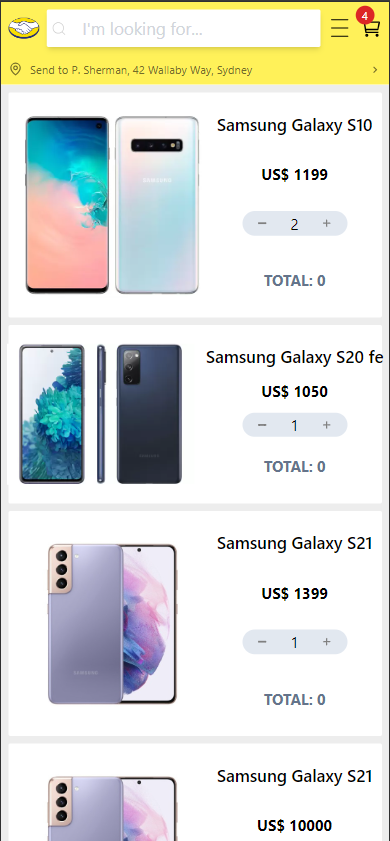

# 🚧 Under Construction 🚧

Mercado Free it's a simple e-commerce app made with React.js 18 version

## How to run:

### First of all, you need to install dependencies
<code>npm install</code>
 
<code>yarn</code>
 
<code>pnpm install</code>

### then, run application
<code>npm run dev</code>
 
<code>yarn dev</code>
 
<code>pnpm run dev</code>

### or run with docker
<code>docker compose up</code>

## Some Screenshots
### Header

